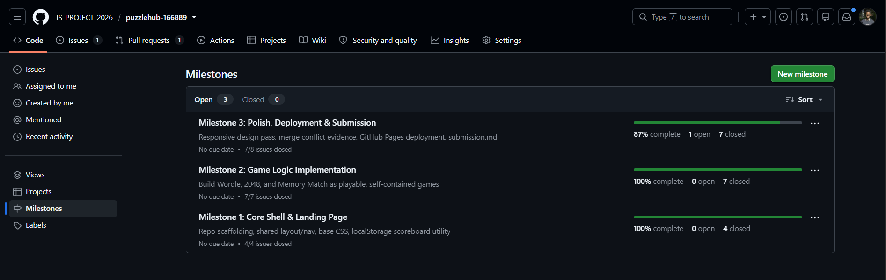
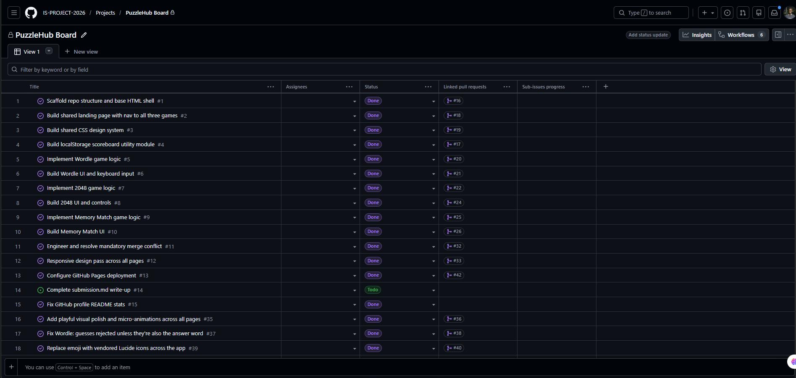
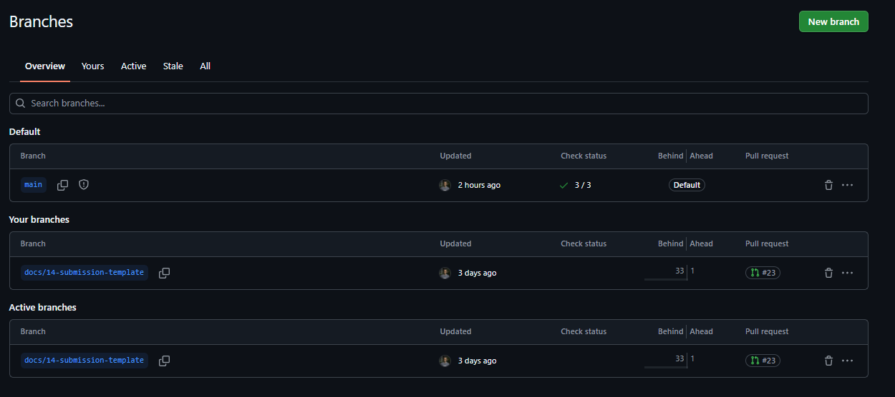
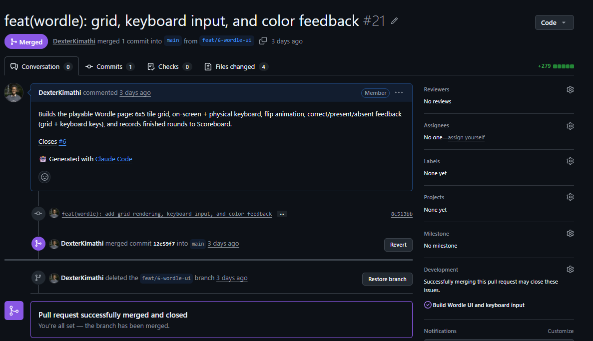
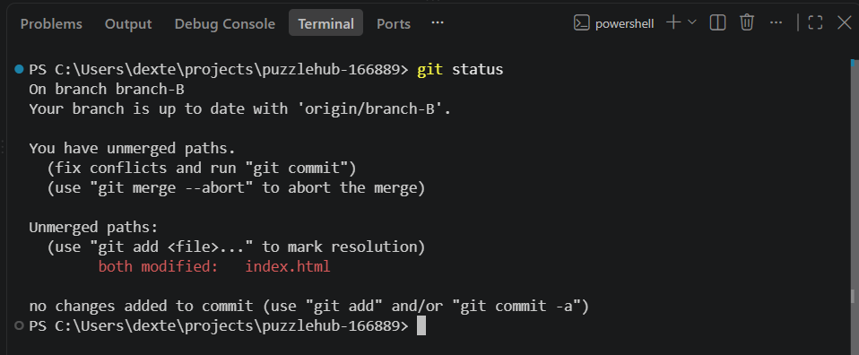
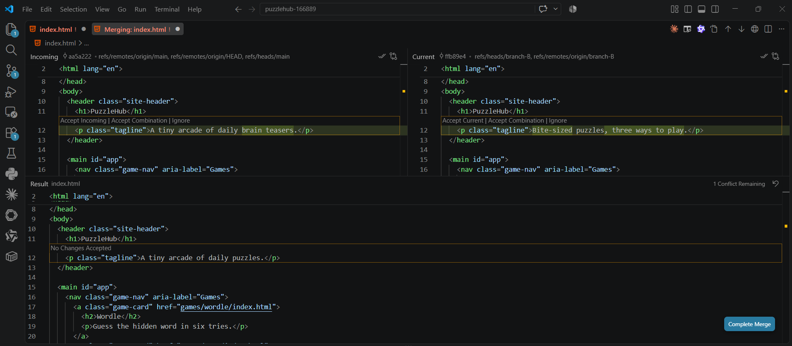
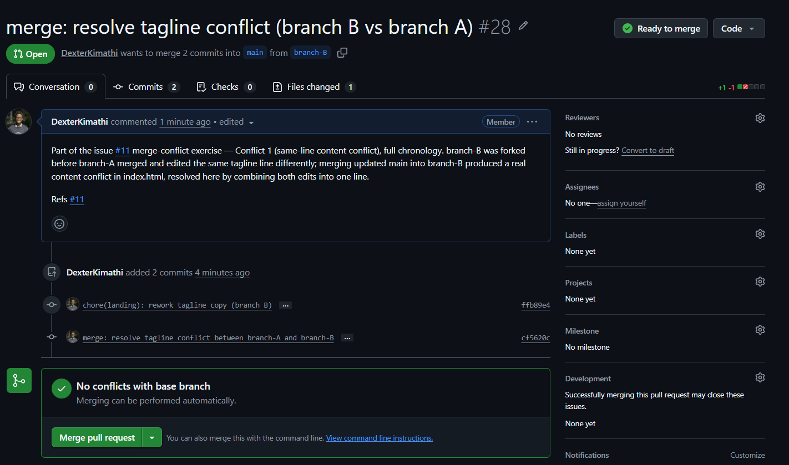
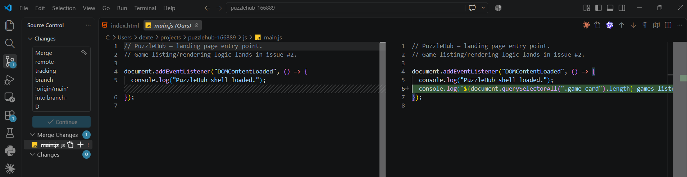
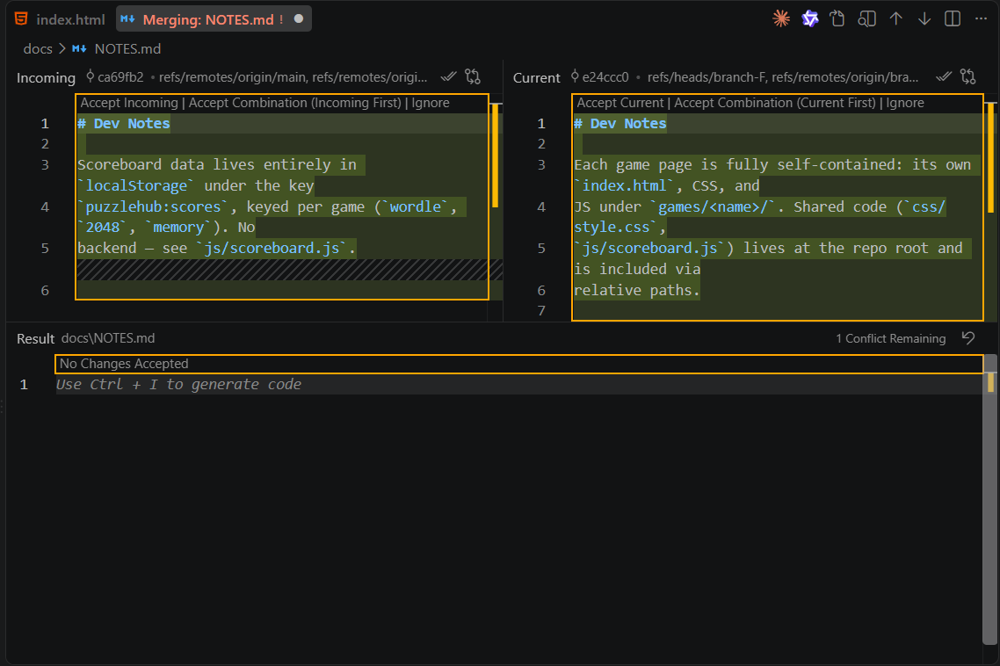

# Project Submission Report

## 1. Student Details

- **Full Name:** Dexter Kimathi
- **GitHub Username:** DexterKimathi
- **Email:** dextermunene05@gmail.com

---

## 2. Deployed Project Link

- **Live GitHub Pages URL:** https://is-project-2026.github.io/puzzlehub-166889/

---

## 3. Reflection — Grounded in Your Git History

> **Rules:** Every answer below **must include a direct link** to the specific commit, PR, issue, or branch in your repository that demonstrates what you are describing. Answers without working links will not be graded. Generic explanations that could apply to any project will receive zero marks.
>
> **Marks:** A (2 marks) · B (1 mark) · C (1 mark) · D (1 mark) = **5 marks total**

### A. Your Best Commit

Paste the URL of the commit in your history that you think best demonstrates clean conventional commit practice (good type tag, clear subject, meaningful body or footer).

- **Commit URL:** https://github.com/IS-PROJECT-2026/puzzlehub-166889/commit/eb102fda8efe399002bd2d2d587a1ccc32d913bf
- **Why this one?** Correct `type(scope):` tag, imperative subject, and a body that explains *why* (the two-pass algorithm for duplicate letters) rather than restating the diff — plus a `Closes #5` footer for traceability.

### B. A Mistake or Struggle

Link to a commit, PR, or issue where something went wrong — a bad commit message you had to fix, a branch you had to delete and recreate, a PR that needed rework, or a deployment that broke. 

- **Link to the evidence:** https://github.com/IS-PROJECT-2026/puzzlehub-166889/pull/27
- **What happened and how did you recover?** The first commit on `branch-A` used `Closes #11` in its footer, which would have auto-closed the 3-conflict tracking issue after merging just the *first* of three conflicts. Caught it before pushing further work, ran `git commit --amend` to change the footer to `Refs #11`, and force-pushed the branch (`git push --force-with-lease`) before opening the PR.

### C. A Pull Request You're Proud Of

Paste the URL of the PR that best shows your self-review process — one where the description is clear, the issue linkage is correct, and the diff tells a coherent story.

- **PR URL:** https://github.com/IS-PROJECT-2026/puzzlehub-166889/pull/40
- **What did you check before merging?** Before merging, I actually launched the site (a local static server + headless Chromium) and screenshotted all four pages to confirm the icon swap rendered correctly with zero console errors — which is how I caught that `.back-link`/`.wordle-message`/`.wordle-key` had only ever been defined in `wordle.css`, so 2048 and Memory Match were silently unstyled. The PR description documents both the intended change and that bug fix.

### D. One Thing You Would Do Differently

If you had to restart this project from scratch with everything you know now, name one specific workflow decision you would change (not a code change — a Git/project management decision).

- **What would you change?** Enforce a hard 50-character subject-line limit from commit one, rather than letting descriptive subjects creep past it. Most of my `feat`/`fix`/`style` commits run 60–75 characters because I packed detail into the subject instead of pushing it down into the body where it belongs.
- **Link to the evidence of the original decision:** https://github.com/IS-PROJECT-2026/puzzlehub-166889/commit/dbedd5d262e67fc5f5602f48ccf4395012074f56 — a 75-character subject line that should have been split, e.g. `feat(2048): implement grid state and move logic` with the merge-rules/win-detection detail moved into the body.

---

## 4. Screenshots of Key GitHub Features

Demonstrate your workflow mechanics by embedding your screenshots below.

> **CRITICAL FOR WORKING IMAGES:** Do not type manual folder paths. Edit this file directly on the GitHub web interface, click on the blank line below each prompt, and **paste (Ctrl+V / Cmd+V)** your screenshot. GitHub will automatically upload the file and generate a permanent, working image link for you.

### A. Milestones and Issues
*Provide a screenshot showing your active milestone(s) and the granular tracking issues linked directly to them.*

* **Caption:** All 3 milestones (Core Shell & Landing Page, Game Logic Implementation, Polish/Deployment/Submission), each with its issues linked and closed as work progressed — Milestone 3 shows the one remaining open issue (this write-up) at time of screenshot.

### B. Project Board
*Provide a screenshot of your GitHub Project Board with your issues organized dynamically across columns (To Do, In Progress, Done).*

* **Caption:** PuzzleHub Board with every issue's live Status auto-tracked from its linked PR (Done once merged) — issue #14 (this write-up) sits in Todo while everything else reads Done, showing real task progression rather than a bulk end-of-project dump.

### C. Branching Architecture
*Provide a screenshot showing your local or remote Git branch list, highlighting your use of conventional, issue-linked naming patterns (e.g., `feat/`, `fix/`, `style/`).*

* **Caption:** GitHub's Branches view — `main` plus the one branch still open at screenshot time, `docs/14-submission-template`, following the `<type>/<issue-number>-<description>` convention used throughout (`feat/`, `fix/`, `style/`, `docs/`). Every other feature branch (`feat/1-...` through `fix/39-...`) followed the same pattern and was deleted automatically on merge, which is why only one remains here.

### D. Pull Requests & Traceability
*Provide a screenshot of a completed or open Pull Request (PR) on GitHub that clearly shows it is linked to a related development issue.*

* **Caption:** [PR #21](https://github.com/IS-PROJECT-2026/puzzlehub-166889/pull/21) ("feat(wordle): grid, keyboard input, and color feedback") — merged into `main` from `feat/6-wordle-ui`, with `Closes #6` in the description, which is why the sidebar shows it as linked development that closed issue #6 on merge.

---

## 5. Merge Conflict Evidence

You must engineer **three merge conflicts**, each triggered by a **different cause** from those covered in the lecture. For Conflict 1, document the full resolution lifecycle. For Conflicts 2 and 3, provide the conflict marker screenshot and identify the cause.

> **Marks:** Conflict 1 full chronology (2 marks) · Conflict 2 (1 mark) · Conflict 3 (1 mark) · All three use distinct causes (1 mark) = **5 marks total**

---

### Conflict 1 — Full Chronology

**What cause did you use?** Same-line content conflict — two branches independently edited the same line of an existing file.

`branch-A` and `branch-B` were both forked from the same commit and both reworded the landing page tagline (`index.html`) differently. `branch-A` merged first; when `branch-B` then merged updated `main` into itself, Git couldn't reconcile the two edits to the same line automatically. Full history: [PR #27](https://github.com/IS-PROJECT-2026/puzzlehub-166889/pull/27) (branch-A, merges clean) → [PR #28](https://github.com/IS-PROJECT-2026/puzzlehub-166889/pull/28) (branch-B, the conflict + resolution).

#### Step 1: Generating the Clash
*Screenshot showing the merge attempt and the conflict warning.*

* **Caption:** Terminal output of `git merge origin/main` on `branch-B` — Git reports `both modified: index.html` after `branch-A`'s tagline edit had already landed on `main`.

#### Step 2: Inside the Code Editor (Conflict Markers)
*Screenshot showing the raw, unresolved conflict markers (`<<<<<<< HEAD`, `=======`, `>>>>>>>`) in your editor.*

* **Caption:** VS Code's 3-way merge view on `index.html` — Current (`branch-B`: "Bite-sized puzzles, three ways to play.") vs. Incoming (`origin/main`, i.e. `branch-A`: "A tiny arcade of daily brain teasers."). Resolved by combining both into one line rather than picking a side, since neither was wrong.

#### Step 3: Resolution & Clean Merge
*Screenshot of your clean Git history or completed PR showing the conflict was resolved and merged.*

* **Caption:** [PR #28](https://github.com/IS-PROJECT-2026/puzzlehub-166889/pull/28) showing "No conflicts with base branch" after the merge commit was resolved locally and pushed — merged cleanly into `main`.

---

### Conflict 2 — Different Cause

**What cause did you use?** Modify/delete conflict.

**Why does this cause trigger a conflict?** One branch (`branch-C`) deleted `js/main.js` as an unused placeholder and merged first. Another branch (`branch-D`), forked before that deletion, extended the same file with a real change. When `branch-D` merged updated `main`, Git had no way to auto-resolve "deleted on one side, modified on the other" — there's no line-level diff to reconcile, so it flags the whole file as conflicted (`deleted by them`) and leaves the decision to the developer. Full history: [PR #29](https://github.com/IS-PROJECT-2026/puzzlehub-166889/pull/29) (branch-C, the deletion) → [PR #30](https://github.com/IS-PROJECT-2026/puzzlehub-166889/pull/30) (branch-D, the conflict + resolution, kept the file since `index.html` still referenced it).

* **Caption:** VS Code Source Control panel on `branch-D` mid-merge — `js/main.js` listed under "Merge Changes", editor shows "main.js (Ours)" retaining `branch-D`'s edit against the deletion from `main`.

---

### Conflict 3 — Different Cause

**What cause did you use?** Add/add conflict.

**Why does this cause trigger a conflict?** `branch-E` and `branch-F` were both forked from the same commit and each independently *created* a new file at the identical path (`docs/NOTES.md`) with different content. Git can't tell which "add" should win, so it treats it as a content conflict between the two new files and inserts standard `<<<<<<<`/`=======`/`>>>>>>>` markers, same as a same-line edit conflict would. Full history: [PR #31](https://github.com/IS-PROJECT-2026/puzzlehub-166889/pull/31) (branch-E, merges first) → [PR #32](https://github.com/IS-PROJECT-2026/puzzlehub-166889/pull/32) (branch-F, the conflict + resolution, kept both notes since they document different things).

* **Caption:** Raw `<<<<<<< HEAD` / `=======` / `>>>>>>> origin/main` markers in `docs/NOTES.md` — `branch-F`'s per-game folder-structure note above the separator, `branch-E`'s scoreboard-storage note below it.

---
##
## 6. Feedback & Evaluation

To help improve this course for future engineering cohorts, please take 2 minutes to fill out the anonymous feedback form. Your honest review helps shape how this program is taught next semester!
- [ ] **Anonymous Evaluation Form:** [Course & Instructor Evaluation](https://forms.gle/YLybnsyXXErKEg3s9)

---
 
## Final Submission
 
Once your repository is complete, submit your work through the official submission form below. The form will **stop accepting responses after Monday, August 17th, 2026** — no late submissions will be accepted.
 
> **Submission Form:** [https://forms.gle/KrT4VxtFtkU3wtYu8](https://forms.gle/KrT4VxtFtkU3wtYu8)
